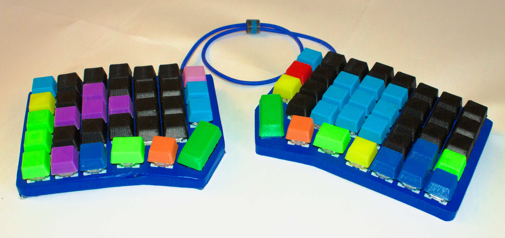

Takmak
==

65% orthogonal staggered column split keyboard you've been looking for!   

You may not use this for any commercial purpose.

Layout
--

http://www.keyboard-layout-editor.com/#/gists/02badad523ed5f81657f6f451307866d

Components
--

2 x Pro Micros  
2 x TRRS breakouts  
71 x Chery MX compatible switches  
71 x 1N4148 diodes  
Wires

The firmware process is described here: https://docs.qmk.fm/

Why the name?
--

Takmak is the name of a famous rock in [Stolby](https://en.wikipedia.org/wiki/Stolby_Nature_Sanctuary) national park that is located nearby my home town Krasnoyarsk. I guess the older I get the more nostalgic I become thus the name.
